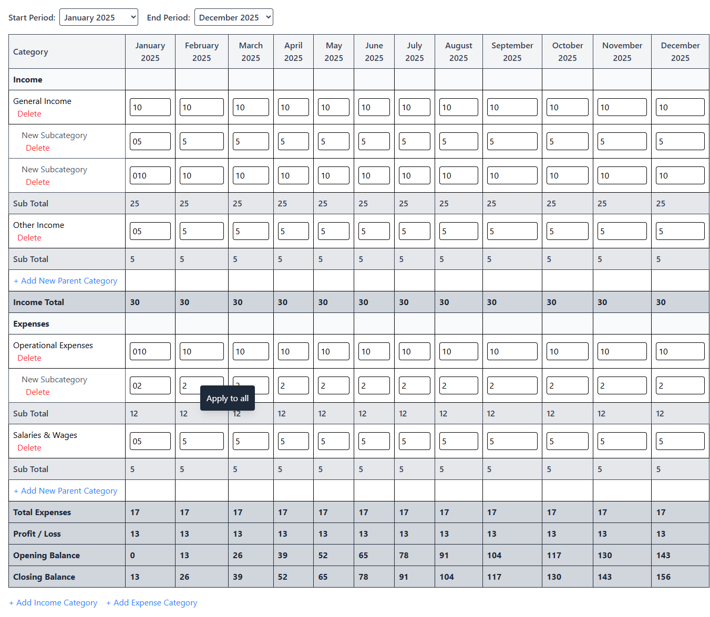

# Budget Builder

## Brief

This project implements a basic Budget Builder table using Angular 19, RxJS, Signals, Tailwind CSS, and TypeScript. Users can input their expected income and expenses per month for a selected date range.

## Key Features

*   **Excel-like UI:** The user interface is designed to mimic the feel of Excel, allowing for intuitive data entry and navigation.
*   **Initial Focus:** The input is automatically focused on the first cell upon page load, enabling immediate typing and category creation.
*   **Navigation:** Users can navigate the table using arrow keys and the Tab key. Pressing Enter creates new category rows.
*   **Carry-Over Balance:** Uses 0 as the opening balance and carries the profit/loss to the next month.
*   **Apply to All:** Right-clicking a cell displays a context menu with an "Apply to All" option, which copies the cell's value to all corresponding cells in the same column.
*   **Real-Time Updates:** Subtotals and overall totals update dynamically as the user inputs values.
*   **Category Grouping:** Income and expense categories are grouped under parent categories, each with their own subcategories.
*   **Delete Row Functionality:** Users can delete rows from the budget table.
*   **Clean and Lightweight Code:** The codebase is designed to be lightweight and maintainable.

## Screenshot


## Technologies Used

*   **Angular:** 19.0.0
*   **RxJS:** For reactive programming and handling asynchronous data streams
*   **Signals:** Angular's built-in reactivity system for efficient change detection
*   **Tailwind CSS:** For styling and responsive design
*   **TypeScript:** For type safety and improved code organization

## Setup Instructions

1.  **Install Node.js and npm:**  Ensure you have Node.js and npm (Node Package Manager) installed on your system.

2.  **Clone the repository:**
    ```bash
    git clone [repository_url]
    cd [repository_directory]
    ```

3.  **Install dependencies:**
    ```bash
    npm install
    ```

4.  **Run the application:**
    ```bash
    ng serve
    ```

    This will start the Angular development server. Open your browser and navigate to `http://localhost:4200/` (or the address specified in the console) to view the application.
